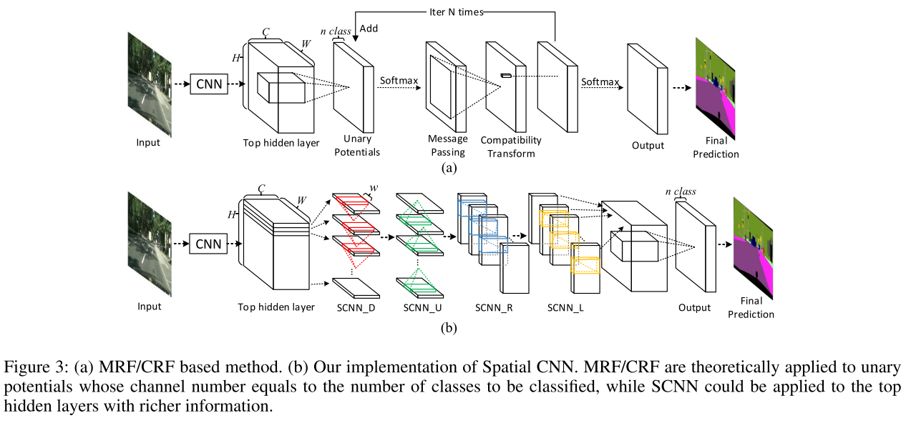
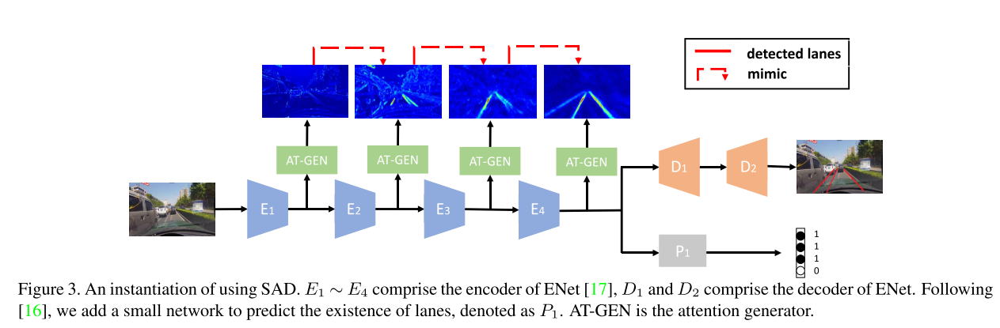
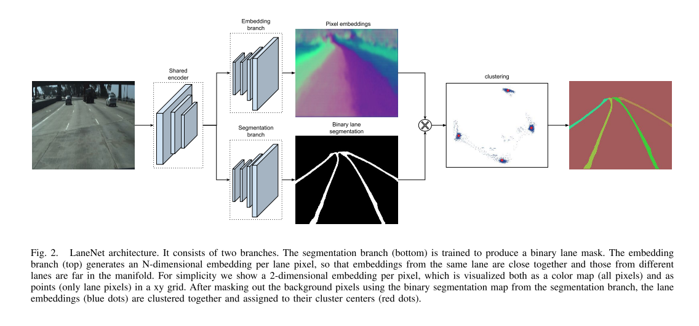
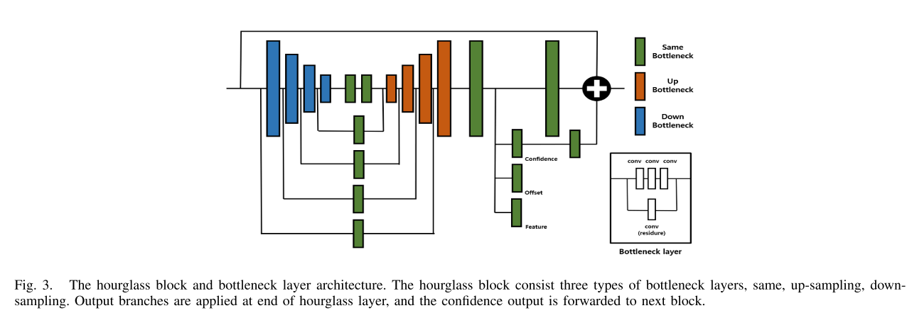
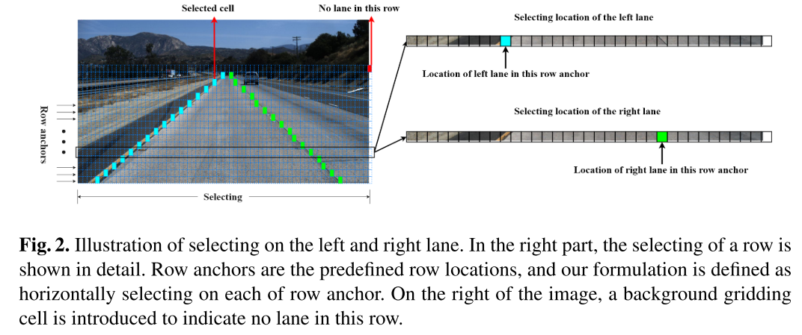
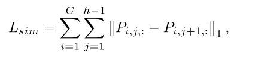
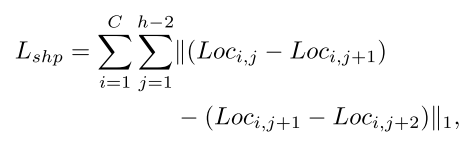
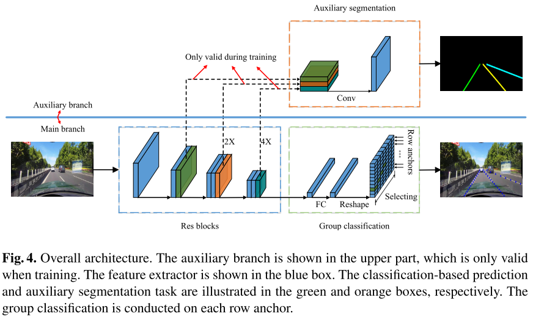

<!-- TOC -->

- [车道线检测](#车道线检测)
  - [数据集](#数据集)
    - [TuSimple. 2017](#tusimple-2017)
    - [CULane. 2018](#culane-2018)
    - [BDD100k. 2018](#bdd100k-2018)
  - [方法](#方法)
    - [基于语义分割](#基于语义分割)
      - [SCNN. 2017](#scnn-2017)
      - [SAD. 2019](#sad-2019)
    - [基于实例分割](#基于实例分割)
      - [LaneNet. 2018](#lanenet-2018)
      - [PiNet. 2020](#pinet-2020)
    - [定义新的车道线范式](#定义新的车道线范式)
      - [UFAST. 2020](#ufast-2020)

<!-- /TOC -->

# 车道线检测

> 知乎讨论
> - https://zhuanlan.zhihu.com/p/53431081 
> - https://zhuanlan.zhihu.com/p/58980251
   
> 相关git：
> - https://github.com/amusi/awesome-lane-detection

> paperwithcode
> - https://paperswithcode.com/task/lane-detection

## 数据集

- TuSimple
- CULane
- Caltech Lanes Washington
- Caltech Lanes Cordova
- BDD100k
  
### TuSimple. 2017   
> link: https://github.com/TuSimple/tusimple-benchmark/tree/master/doc/lane_detection  

数据集说明：
- 场景多为高速公路，挑战性较低
- 2车道／3车道／4车道／或更多
- 训练集3626个注释帧，测试集2944个注释帧，每张图片大小1280*720

### CULane. 2018   
> link: https://xingangpan.github.io/projects/CULane.html

数据集说明：
- **北京市区内**六个不同的车辆视角
- 障碍物另外一边的车道线不会被标注
- 数据集难度更大
- 133235帧，88880训练，9675验证，34680测试
  - 测试集分为normal和8个challenging categories，总共有9个属性

### BDD100k. 2018
> link: https://bair.berkeley.edu/blog/2018/05/30/bdd/

数据集说明：
- 开放驾驶视频数据集，包含车道线标注
- 车道线靠的很密，难度很大，很多论文并未提供在这个数据集上的检测结果
- 10万个视频序列，标注了垂直车道线和平行车道线（人行道），提供车道线属性，如单线vs双线，实线vs虚线

## 方法
> paperwithcode: https://paperswithcode.com/task/lane-detection

车道线检测特点
- 车道线在图像中占比低，形状窄长，增加了特征检测的难度
- 附近树木和建筑物的阴影产生的误导性边缘和纹理
- 后处理很重要，通过聚类、拟合、采样等方式得到一条完整的平滑的车道线

车道线检测算法分类：
- 基于语义分割
  - SCNN
  - SAD
- 基于实例分割
  - LaneNet
  - PiNet
- 定义新的车道线范式
  - UFAST
 

### 基于语义分割

#### SCNN. 2017
> Spatial As Deep: Spatial CNN for Traffic Scene Understanding.
> code：https://github.com/XingangPan/SCNN

> 创新点
- 提出CULane数据集
- Spatial CNN (SCNN)：类似于循环神经网络，四个方向依次做一元的消息传递。比传统的空间关系建模方式更有效率
- 车道线检测后处理
  - 多类别的语义分割，4个车道线视为不同的类别
  - 分割的同时有一个分类分支，判断对应车道线是否存在
  - 对于存在值大于0.5的每一个车道标记，我们每20行搜索对应的probmap，查找响应最高的位置。这些位置然后由三次样条曲线连接，得到最终的预测。

> 缺点
- 固定数量车道线检测
- SCNN前传依然十分耗时

#### SAD. 2019
> Learning Lightweight Lane Detection CNNs by Self Attention Distillation. 

> 创新点
- Self Attention Distillation (SAD)：允许模型从自己学习b并获得实质性的改进，不需要任何额外的监督或标签。
  - 让前面的块模仿更深的块的注意力输出。即block3模仿block4的统计输出，block2模仿block3的统计输出。（统计方式为特征图通道级别求和生成一个响应图）
  - SAD只在训练阶段使用，不增加推理时间
- 车道线后处理方式
  - 与SCNN一致

> 缺点
- 固定数量车道线检测

### 基于实例分割 

#### LaneNet. 2018
> Towards End-to-End Lane Detection: an Instance Segmentation Approach. 

> 创新点
- 实例分割处理车道线，输出二值掩码和特征embedding，对embedding聚类生成车道线。可以检测任意条车道线
- 车道线后处理方式
  - 训练一个神经网络输出一个仿射变化矩阵。将原始图像转换为“鸟瞰图”
  - 在鸟瞰图上对每个车道实例进行三阶多项式曲线拟合，拟合后可以再将曲线映射回原图。（在鸟瞰图上拟合可以在保持计算效率的同时提高拟合质量）

#### PiNet. 2020
> Key Points Estimation and Point Instance Segmentation Approach for Lane Detection. 

> 创新点：
- 与LaneNet网络类似，生成confidence和feature embedding图，额外增加了一个offset分支，使得生成的点位置更准确
- 车道线后处理方式
  - 渐进式的搜索局部拟合最好的点

### 定义新的车道线范式

#### UFAST. 2020
> Ultra Fast Structure-aware Deep Lane Detection. 

> 创新点：
- 提出一种新的区别于分割的车道线检测范式：利用全局特征在图像预定义行中选择车道位置的方法，而不是基于局部感受野对车道的每个像素进行分割，大大降低了计算代价。
  - 用网格来定义全图。对每一行网格上的单个网格点进行分类，将其分为背景和第i个车道线。（车道线数量是固定的）
  - 网格数量远少于像素数量，极大的提升运行速度
  

  
- 结构化损失
  - 同一个车道线网格是连续的。上下网格row的预测输出应该类似，使用L1范数进行约束。

      

  - 大多数车道线是直的（即使对于弯曲车道线，由于视角因素，其主体依然是直的）。利用二阶差分方程来约束车道线的形状，对于直线情况，差分为零。
  
       

  

